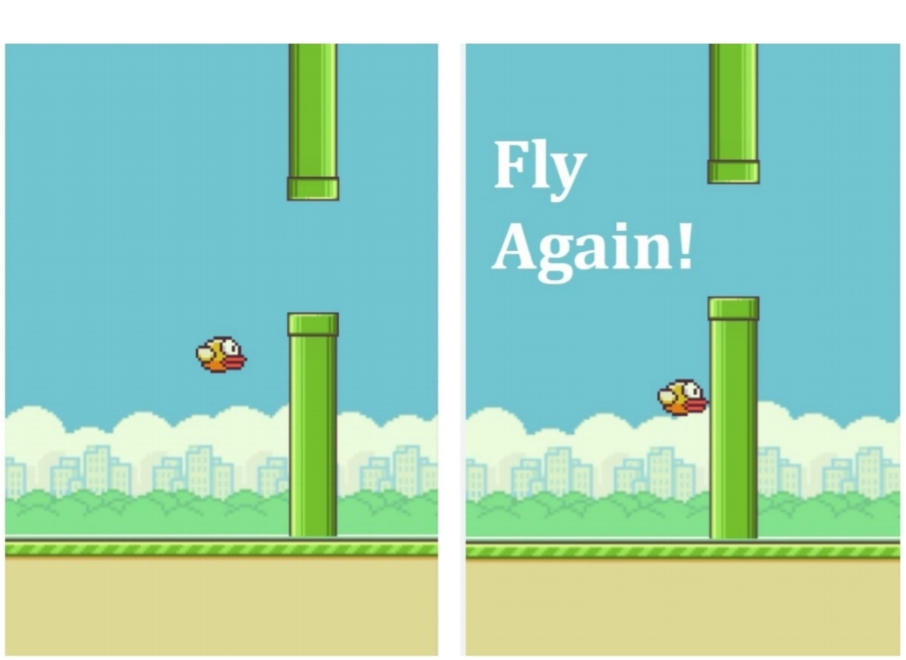

# Flappy_Bird

A Flappy Bird Game made using <strong>Javascript</strong>.
It's a Web Based Application and the purpose of this game is to play and have fun. <br>
In this Game the player controls a bird, attempting to fly between columns of green pipes without hitting them.<br>
The idea of the game is to flap your bird through as many pipes as possible.<br>
The bird briefly flaps upward each time the player presses the key , if the key is not pressed, the bird falls due to gravity.<br>
So, Help the bird to flutter and get as far as possible. # avoid obstacles #
<br>
<br>

<h3>Clone the Repository :</h3>


```bash

git clone https://github.com/ruhirani011/BirdGame

 ```
OR download as a zip file and extract.


<h3>How to Use :</h3>
 
  - Use <kbd>&uarr;</kbd> or <kbd>Space </kbd> key to play and to make the bird fly.
 <br>
  <h3>Try it here :</h3>
 https://ruhirani011.github.io/BirdGame/




<h3>Technologies Used :</h3>


- HTML
- CSS
- JAVASCRIPT
